# 🖼️ SL Photo Converter 

> A simple and practical serverless image converter built to learn and explore AWS.

[](#)
[](#)
[](#)
[](https://dm8g57umos2n0.cloudfront.net)

## 📖 Project Overview
SL Photo Converter is a lightweight web application that allows users to easily convert image formats (e.g., JPG, PNG, WebP) directly in their browsers. 

I built this project as a hands-on way to practice and understand AWS cloud services. Instead of using a traditional server that runs 24/7, this project uses an **AWS Serverless Architecture**. This means the system only runs when someone is actually converting a photo, making it highly cost-effective and a great way to learn cloud-native development.

🔗 **Live Demo:** https://dm8g57umos2n0.cloudfront.net

## 🏗️ System Architecture

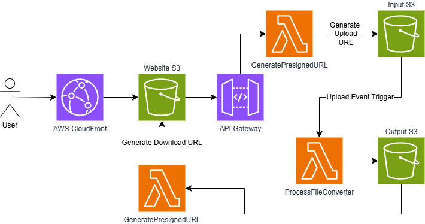

### How it works:
1. **Client Request:** User accesses the static frontend hosted on S3 via CloudFront.
2. **Upload Ticket Generation:** The frontend requests an upload ticket. API Gateway triggers `GeneratePresignedURL`, which generates a time-limited **S3 Presigned URL**.
3. **Direct Upload:** The client uploads the original image directly to the S3 Input Bucket using the Presigned URL.
4. **Event-Driven Processing:** The S3 upload event automatically triggers `ProcessFileConverter`.
5. **Conversion:** `ProcessFileConverter` processes the image, converts it to the target format, and saves it to the S3 Output Bucket.
6. **Download:** The frontend polls for completion and retrieves the converted image via a secure download Presigned URL.

## 🛠️ Tech Stack

**Frontend:**
* HTML5, CSS3, JavaScript

**Backend & Cloud Infrastructure (AWS):**
* **Website Hosting:** Amazon S3
* **Compute:** AWS Lambda
* **Storage:** Amazon S3
* **Networking & Delivery:** Amazon CloudFront, Amazon API Gateway
* **Security & IAM:** AWS Identity and Access Management (IAM), S3 CORS, OAC

## 🎯 Learning Journey (Why I built this)

This project helped me step up from basic AWS tutorials to building a complete, secure, and cost-optimized system. It covers:
* Connecting different AWS services (S3, Lambda, API Gateway) securely.
* Learning Serverless concepts (zero-server management).
* Setting up basic cloud security (OAC, API Throttling).
* Understanding cost management (using S3 Lifecycle rules to delete files automatically).

## Local Setup & Deployment Guide

For anyone trying to replicate this architecture, follow this high-level deployment order:

### Phase 1: Set Up Environment(S3, Lambda)
1. Clone the repository:
```bash
   git clone https://github.com/Shieliang/SL_Photo_Converter.git
```

2. Create S3 Buckets: Create three separate S3 buckets (e.g., frontend-hosting, image-input, image-output). Your website bucket need to disable Block all public access while other 2 just give it a name remain all settings same.  
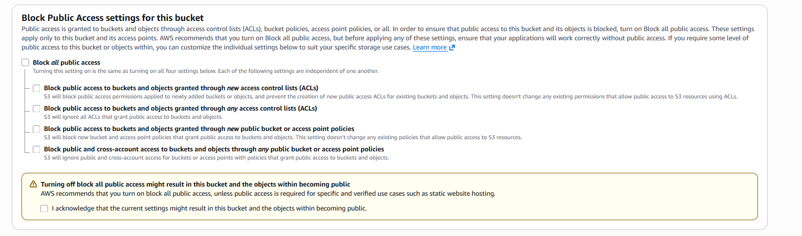

3. Configure S3 CORS (Crucial for direct upload): Go to your image-input bucket's Permissions tab, scroll down to Cross-origin resource sharing (CORS), and paste the following JSON to allow frontend uploads. Repeat this for the image-output bucket.
```json
[
    {
        "AllowedHeaders": [
            "*"
        ],
        "AllowedMethods": [
            "PUT",
            "POST",
            "GET"
        ],
        "AllowedOrigins": [
            "*"
        ],
        "ExposeHeaders": []
    }
]
```

4. Create Lambda: Create two Lambda functions for 'GeneratePresignedURL' and 'ProcessFileConverter'. Change Runtime to Python 3.14.
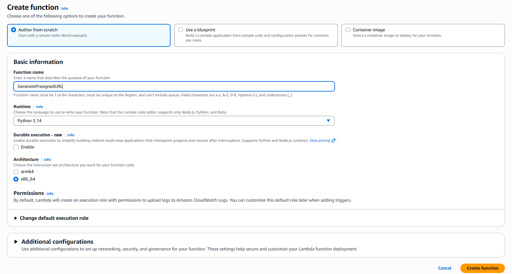

5. Install 'Pillow' at AWS Cloud Shell: 

> **💡 Why do we need this?**
> AWS Lambda's default Python environment does not include external libraries like `Pillow`. Since our project needs to convert image formats (e.g., from JPG to WebP), we must manually package the `Pillow` library into a **Lambda Layer**. Using AWS CloudShell ensures the library is compiled in a Linux environment identical to Lambda, preventing compatibility errors.

**Step 1**
```bash
    mkdir python
```

**Step 2**
```bash
    pip3 install Pillow -t python/
```

**Step 3**
```bash
    zip -r pillow-layer.zip python/
```

**Step 4**
```bash
    aws lambda publish-layer-version \
    --layer-name pillow-layer \
    --description "Pillow library for image conversion" \
    --zip-file fileb://pillow-layer.zip \
    --compatible-runtimes python3.10 python3.11 python3.12 python3.13 python3.14
```

### Phase 2: Website Set Up
1. Open your website S3 bucket (e.g. frontend-hosting).

2. Update API Endpoint: Before uploading, open the index.html (or script.js) you downloaded from GitHub. Find the API URL variable and replace it with your own API Gateway endpoint (You will get this in Phase 4. If you don't have it yet, you can upload the file first and re-upload the updated version later).

3. Upload the 'index.html' you downloaded from GitHub.

4. Go to 'Properties' Tab, scroll down to ‘Static Website Hosting’ section and click edit button.
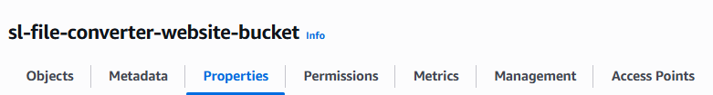

5. Enable static website hosting, type 'index.html' at index document and click save changes button.
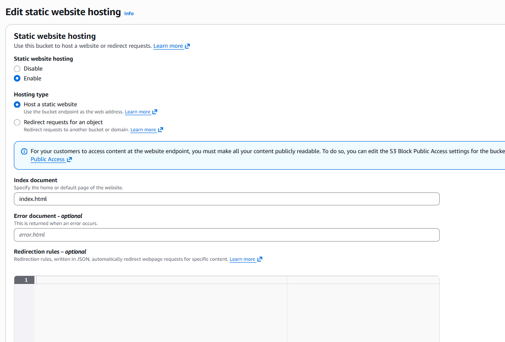

6. After save changes, it will create a bucket website endpoint. Click it and see if you can access to website. If you can see it, that means you can proceed to next phase.
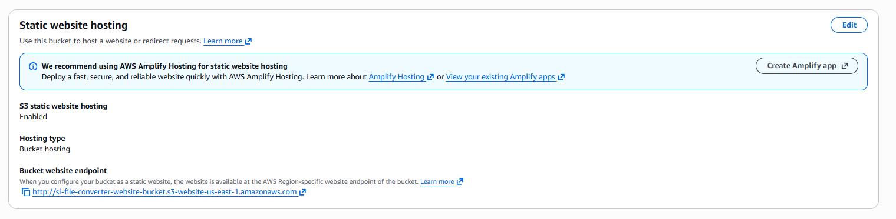

### Phase 3: Lambda Configuration
1. Open 'GeneratePresignedURL' lambda function, copy code from the lambda folder you just downloaded, paste it into the code and click deploy button. Remember to change the bucket name to actual bucket name.
    - Crucial Step: Make sure to replace the INPUT_BUCKET and OUTPUT_BUCKET variables in the code with the actual names of your buckets created in Phase 1!

2. Go to 'Configuration' Tab and click the role name.
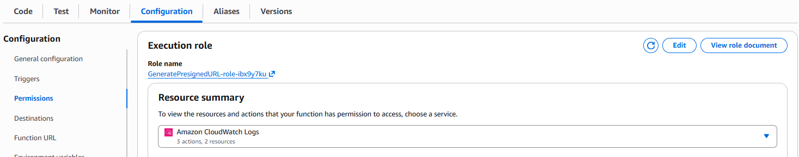

3. Click add permission --> create inline policies. Clear all, copy and paste code below (Remember to replace YOUR-INPUT-BUCKET-NAME and YOUR-OUTPUT-BUCKET-NAME), and save changes.
```json
{
	"Version": "2012-10-17",
	"Statement": [
		{
			"Effect": "Allow",
			"Action": "s3:PutObject",
			"Resource": "arn:aws:s3:::YOUR-INPUT-BUCKET-NAME/*"
		},
		{
			"Effect": "Allow",
			"Action": "s3:GetObject",
			"Resource": "arn:aws:s3:::YOUR-OUTPUT-BUCKET-NAME/*"
		}
	]
}
```

4. Repeat Step 1 - 2 for 'ProcessFileConverter'. 
    - Attach the Pillow Layer: Scroll to the bottom of the ProcessFileConverter function page, click Add a layer -> Custom layers, and select the pillow-layer you created in Phase 1. This is required for image processing!

5. For ProcessFileConverter click add permission --> create inline policy. Clear all, copy and paste code below, and save changes.
```json
{
	"Version": "2012-10-17",
	"Statement": [
		{
			"Effect": "Allow",
			"Action": [
				"s3:GetObject"
			],
			"Resource": "arn:aws:s3:::YOUR-INPUT-BUCKET-NAME/*"
		},
		{
			"Effect": "Allow",
			"Action": [
				"s3:PutObject"
			],
			"Resource": "arn:aws:s3:::YOUR-OUTPUT-BUCKET-NAME/*"
		}
	]
}
```

6. Back to the ProcessFileConverter, click Add Trigger, source put 'S3' --> event types put 'All object create events' --> Click Add.

### Phase 4: API Gateway Configuration
1. Go to AWS API Gateway --> Create an API  --> Select HTTP API and click build.
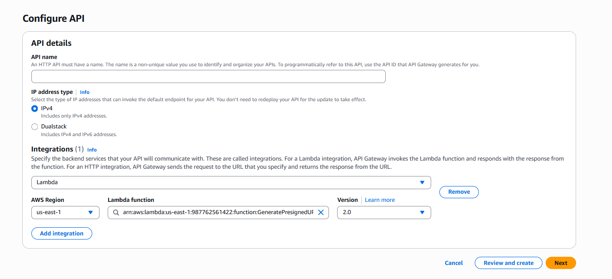

2. Give it a name, click add integrations, select lambda and pick the 'GeneratePresignedURL' lambda function. Click next.

3. Click add route, select 'GET' method, resource path put '/get-url', integration target put 'GeneratePresignedURL'.
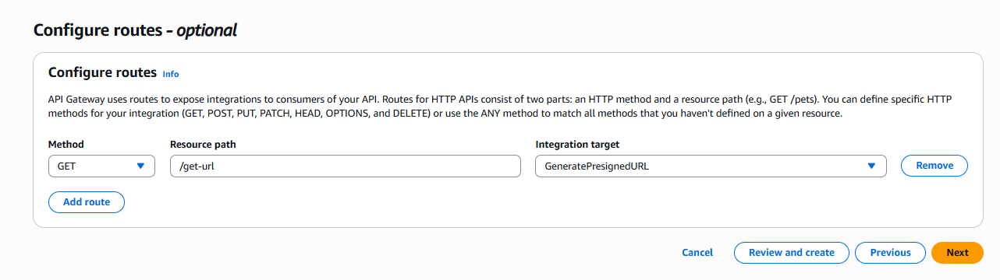

4. Click next and create.

5. After it's created, open the API you just create and go to 'CORS' tab at left. Click configure, Access-Control-Allow-Origin put '*' first, later we will replace it with the cloudfront endpoint. Access-Control-Allow-Methods put 'GET' and 'OPTIONS'.
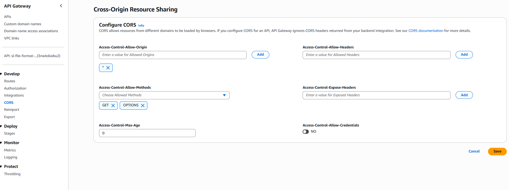

6. Go to 'Throttling' tab, select 'default' stage --> edit default route throttling --> burst limit to 10 rate limit to 5 (1 sec max capacity is 10 requests, normal capacity is 5)

### Phase 5: Cloudfront Configuration
1. Go to CloudFront and click create distribution.

2. Select Free plan --> Give it a name and continue --> Origin type put S3, Origin browse your website S3 bucket.
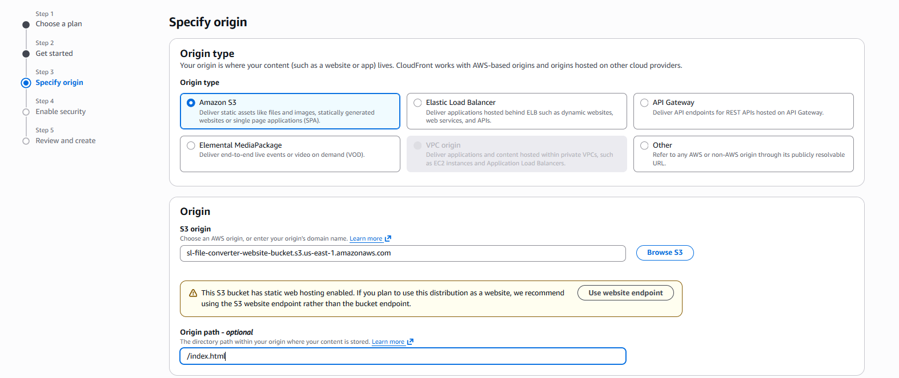

3. Click next and create distribution.

4. After it's created, open it, go to Origin tab select the origin and click edit.

5. Find Origin Access Control section, and click copy policy.
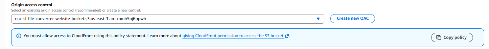

6. Go to your website S3 bucket --> Permission tab --> edit bucket policy --> paste it and save.

### Phase 6: Test Your Website
1. Go to CloudFront and open it.

2. Copy and paste your distribution domain name into the browser, and it should navigate you to the website.

3. If you want to make your api more secure, go to your API and change Access-Control-Allow-Origin to your cloudfront website endpoint.

4. Congratulations!

### Phase 7: Cost Optimization (S3 Lifecycle Rules)
To ensure your AWS bill stays at $0.00, we need to automatically delete the uploaded and converted images after 1 day.

1. Go to your `image-input` S3 bucket and click the **Management** tab.

2. Scroll down to **Lifecycle rules** and click **Create lifecycle rule**.

3. **Lifecycle rule name:** Put `DeleteOldImages`.

4. **Rule scope:** Select **Apply to all objects in the bucket** and check the "I acknowledge..." warning box below it.

5. **Lifecycle rule actions:** Check the box for **Expire current versions of objects**.

6. **Expire current versions of objects:** In the "Days after object creation" field, enter `1`.

7. Click **Create rule**. 

8. **Repeat Steps 1-7** for your `image-output` bucket. Now your serverless converter will automatically clean up after itself!

## ☕ Support My Learning
If you found this project helpful or interesting, feel free to buy me a coffee! It helps me to produce more fun projects.
<a href="https://www.buymeacoffee.com/shieliang22" target="_blank">
  
</a>